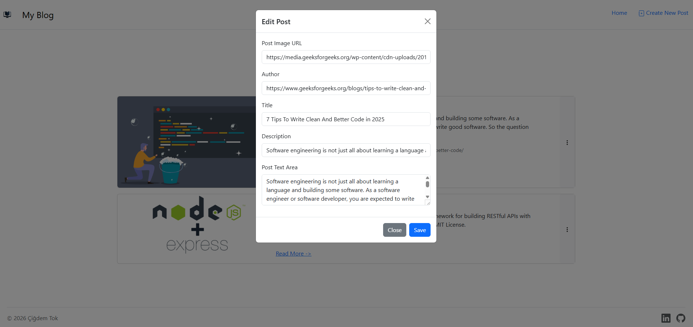
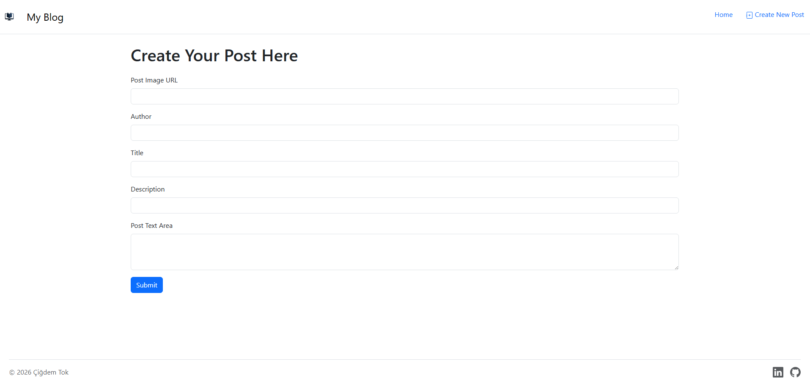

# Blog Web Application
A fully functional Blog Web Application built as part of The Complete Web Development Bootcamp by Dr. Angela Yu. This project demonstrates the ability to handle complex routing, server-side rendering with EJS, and client-side interactions using Fetch API and jQuery.

## 🚀 Features
- **Full CRUD Functionality:** Create, Read, Update, and Delete blog posts.
- **Dynamic Routing & SEO-friendly Slugs:** Personalized pages for each blog post using unique IDs and SEO-friendly slugs, converting titles into URL-safe strings (handling special characters like ç, ğ, ş, ı, ö, ü).
- **Asynchronous Operations:** Uses the **Fetch API** and **jQuery** to handle Delete and Update requests without full page reloads for a smoother user experience.
- **Responsive UI:** Styled with **Bootstrap** for a mobile-first, modern design.
- **In-Memory Data Management:** Efficiently manages post data using JavaScript objects with unique ID generation(suitable for demonstration/portfolio purposes).

## 🛠️ Tech Stack
- **Frontend:** EJS, HTML5, Bootstrap, JavaScript, jQuery
- **Backend:** Express.js, Node.js

## 🖼️ Screenshots
### Home 


### Detail Page


### Edit Modal


### Create Page


## 📦 Installation & Setup
1. **Clone the repository:**
```bash
git clone <repository-url>
```
2. **Navigate to the project directory:**
```bash
cd CapstoneProject3-BlogWebApp
```
3. **Install dependenciees:**
```bash
npm install
```
4. **Start the server**
```bash
node index.js
```
5. **Open in browser:**
```
http://localhost:3000
```

## 📂 Project Structure
```
├── public/                # Static files (CSS, JS, )
│   ├── assets/            # Screenshots, logo
│   └── js/                # Client-side scripts (main.js)
├── views/                 # EJS templates
│   ├── partials/          # Header and Footer
│   ├── index.ejs          # Home page (Post list)
│   ├── postDetails.ejs    # Individual post view
│   └── createPost.ejs     # Form to add new posts
├── index.js               # Main Express server and logic
├── package.json           # Project dependencies
└── README.md
```
## 🤝 Contributing & Feedback
Thank you for checking out my project! I am constantly looking to improve, so your feedback is highly appreciated. 

If you have any suggestions, bug reports, or just want to say hi, feel free to open an issue or reach out!

**Happy Coding!** 🚀
