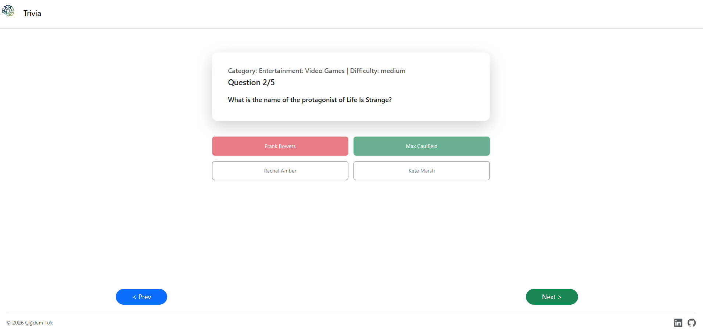
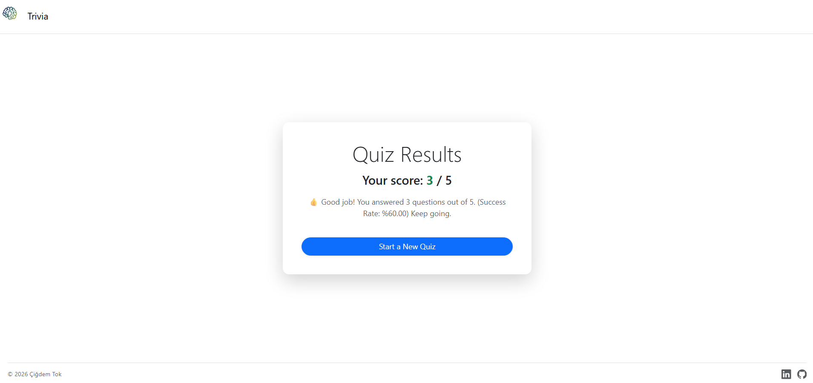

# Trivia Quiz Game
This project is a dynamic quiz application developed as part of The Complete Web Development Bootcamp. It demonstrates the ability to integrate public APIs, handle asynchronous data, and manage complex client-side logic.

## 🎯 Project Overview
The objective of this project was to create a web-based trivia game that fetches real-time questions from the [Open Trivia Database API](https://opentdb.com/api_config.php). Users can customize their experience by choosing the number of questions, category, difficulty level, and answer type. The application focuses on robust API communication and providing a seamless, interactive user interface.

## 🚀 Features
- **API Integration:** Uses Axios to communicate with the Open Trivia DB API.
- **Customizable Quizzes:** Dynamic URL construction based on user-selected criteria (Category, Difficulty, Type).
- **Interactive Quiz Flow:** A single-page quiz experience where questions are rendered dynamically without refreshing the page.
- **Dynamic Quiz Engine & Data Processing:** Integrated the `he` library for seamless HTML entity decoding, implemented the **Fisher-Yates Shuffle** algorithm for randomized answer delivery, and built a custom analytics logic to provide real-time success rates and personalized feedback.

## 🛠️ Tech Stack
- **Frontend:** EJS, HTML5, Bootstrap, JavaScript, jQuery
- **Backend:** Express.js, Node.js, Axios(API Requests)

## 🖼️ Screenshots
### Home 


### Questions Page


### Result Page


## 📦 Installation & Setup
1. **Clone the repository:**
```bash
git clone <repository-url>
```
2. **Navigate to the project directory:**
```bash
cd CapstoneProject4-QuizApp
```
3. **Install dependenciees:**
```bash
npm install
```
4. **Start the server**
```bash
node index.js
```
5. **Open in browser:**
```
http://localhost:3000
```

## 📂 Project Structure
```
├── public/
│   ├── js/
│   │   └── main.js          # Quiz logic, shuffling, and navigation
│   └── assets/              # Logo and images
├── views/
│   ├── partials/            # Header and Footer
│   ├── index.ejs            # Setup form
│   ├── quiz.ejs             # Question display
│   └── result.ejs           # Performance summary
├── index.js                 # Server & API route management
└── package.json             # Project dependencies
└── README.md
```

## 🤝 Contributing & Feedback
Thank you for checking out my project! I am constantly looking to improve, so your feedback is highly appreciated. 

If you have any suggestions, bug reports, or just want to say hi, feel free to open an issue or reach out!

**Happy Coding!** 🚀
