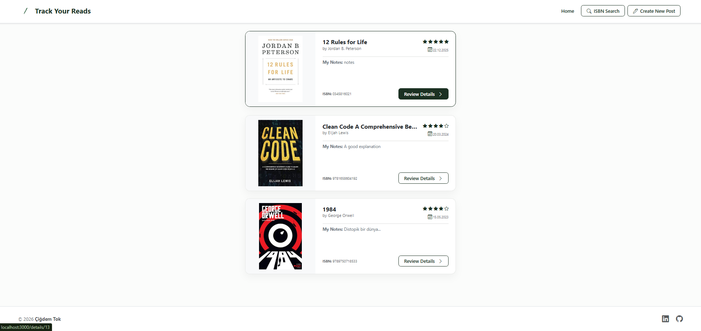
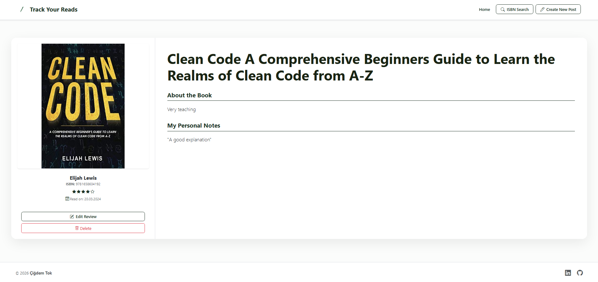
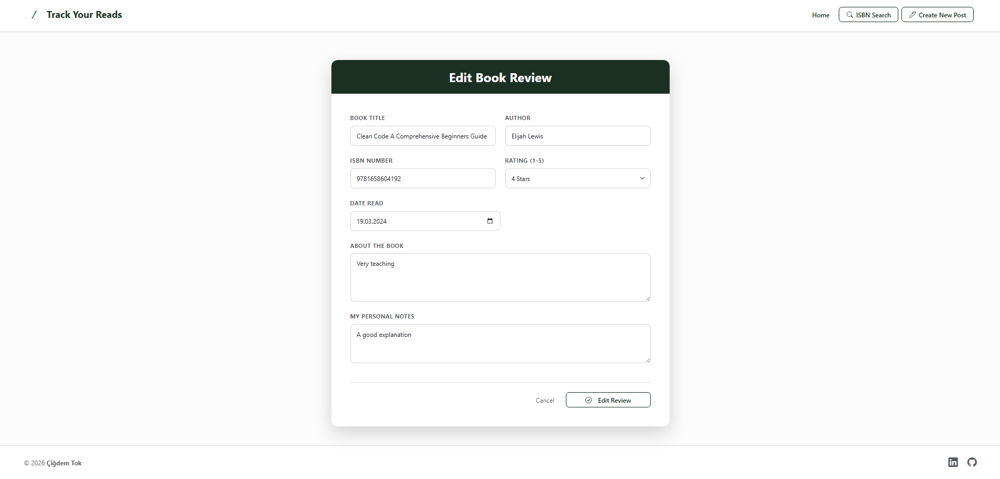
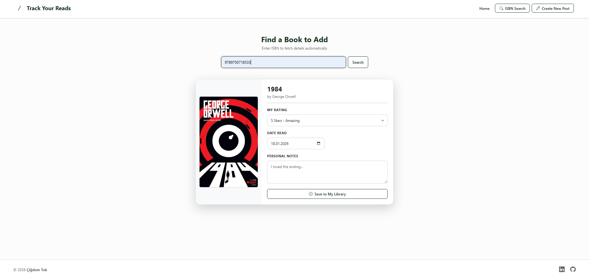
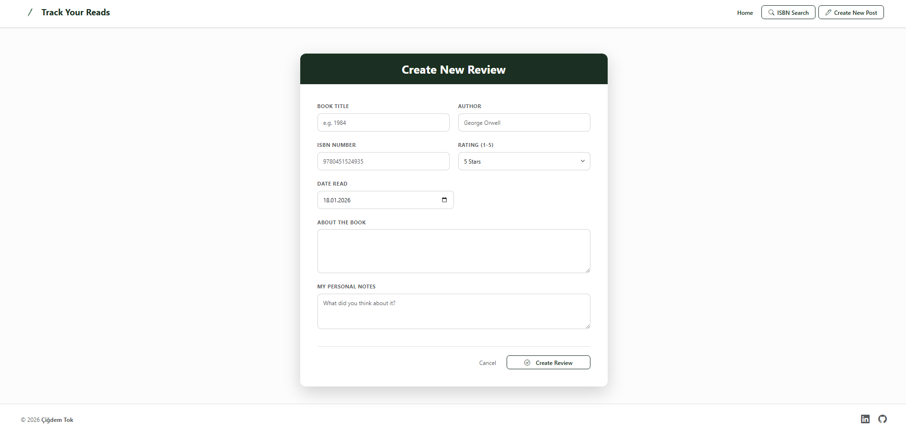

# Track Your Reads - Book Notes App
Track Your Reads is a full-stack web application designed for book lovers to keep track of their reading journey. You can manually type every detail or you can simply enter an ISBN number, and the app will automatically fetch book details (cover, title, author, description) using the [Open Library API](https://openlibrary.org/developers/api).

## 🚀 Features
- **Smart ISBN Search:** Automatically fetch book metadata and covers via Open Library API.
- **Personal Library:** Save books to your database with personal ratings (1-5 stars) and notes.
- **Full CRUD Functionality:** View your list, read full details, edit your notes/ratings, or delete entries.
- **Database Integration:** Persistent storage using PostgreSQL to keep your reading history safe.
- **Dynamic UI:** A clean, responsive interface built with EJS and Bootstrap.

## 🛠️ Tech Stack
- **Frontend:** EJS, HTML5, CSS3, Bootstrap
- **Backend:** Express.js, Node.js
- **Database:** PostgreSQL
- **Tools:** Axios, Body-Parser, Dotenv, PG(node-postgres)

## 🖼️ Screenshots
### Home 


### Details Page


### Edit Page


### Search by ISBN Page


### Create Page


## 📦 Installation & Setup
### Prerequisites
- Node.js & NPM installed.
- PostgreSQL database instance running.

### Installation
1. **Clone the repository and navigate to the project directory:**
```bash
git clone <repository-url>
cd CapstoneProject5-BookNotes
```
2. **Install dependenciees:**
```bash
npm install
```
3. **Database Setup:** Create a table in your PostgreSQL database using the following SQL command:
```sql
CREATE TABLE books_read (
  id SERIAL PRIMARY KEY,
  title VARCHAR(255) NOT NULL,
  author VARCHAR(255),
  isbn VARCHAR(20) UNIQUE,
  rating INTEGER,
  description TEXT,
  notes TEXT,
  date_read DATE
);
```
4. **Enviroment Configuration:** Create your `.env` file by copying the template:
```bash
cp .env.example .env
```
Open the `.env` file and update it with your local PostgreSQL credentials.

5. **Start the application:**
```bash
# Using node
node index.js

# Or using nodemon (if installed)
nodemon index.js
```
6.  **Open in browser:**
```
http://localhost:3000
```
 
## 📂 Project Structure
```
.
├── public/                 # Static files
│   ├── assets/             # Images and logos
│   └── styles/             # CSS stylesheets
├── views/                  # EJS Templates
│   ├── partials/           # Header and Footer
│   ├── index.ejs           # Home page (Book list)
│   ├── details.ejs         # Individual book view
│   ├── createNewBook.ejs   # Add/Edit manual entry
│   └── searchByIsbn.ejs    # API search results & save
├── index.js                # Main Express server & logic
├── .env                    # Environment variables (private)
├── .env.example            # Environment variables template
├── package.json            # Project dependencies
└── README.md               # Project documentation
```

## 🤝 Contributing & Feedback
Thank you for checking out my project! I am constantly looking to improve, so your feedback is highly appreciated. 

If you have any suggestions, bug reports, or just want to say hi, feel free to open an issue or reach out!

**Happy Coding!** 🚀
