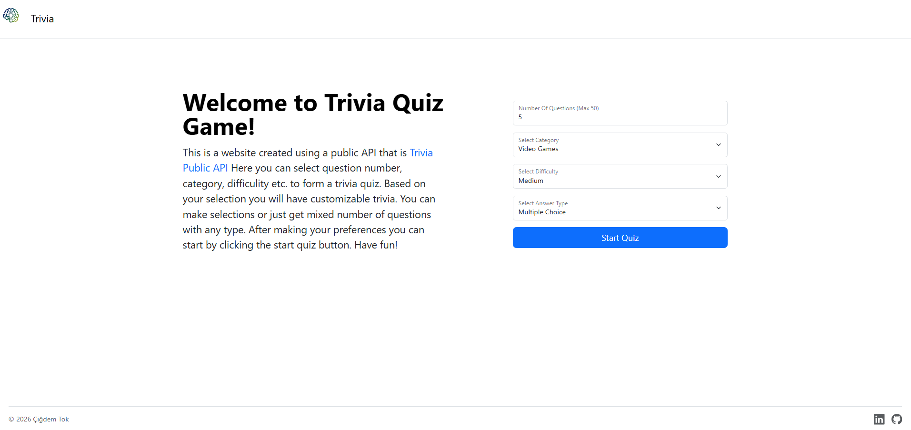
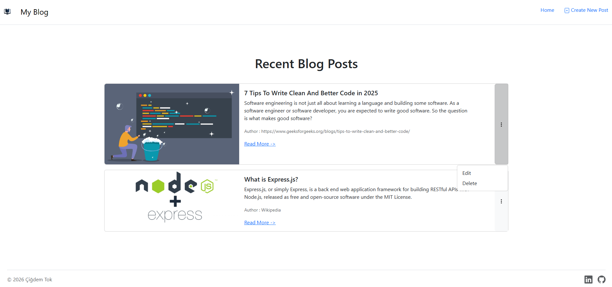
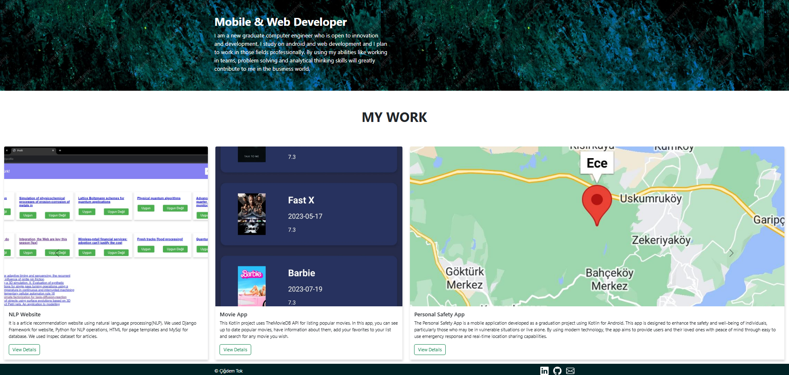

# Full-Stack Web Development Journey

This repository is a comprehensive collection of my work, projects, and progressive learning journey through the Full-Stack Web Development curriculum. It documents my transition from fundamental styling to building complex and secure web applications. I followed Angela Yu's [The Complete Full-Stack Web Development Bootcamp](https://www.udemy.com/course/the-complete-web-development-bootcamp/) and these are capstone projects/assignments that I build during course. These were not only practices in the course but other ones had answers and these ones are the projects that I built from scratch.

## 🎓 Learning Path Overview

The curriculum followed a careful path through the following core topics:

- **Frontend:** Moving beyond HTML/CSS and Bootstrap into modern UI development with **React.js**, focusing on component-based architecture and state management.
- **Backend:** Building robust server-side logic using **Node.js** and **Express**, implementing RESTful practices.
- **Data Persistence:** Architecting relational databases with **PostgreSQL**, writing complex SQL queries, and managing data integrity.
- **Security & Authentication:** Implementing real-world security measures including **Passport.js**, session management, and password hashing (Bcrypt).

---

## 🚀 Featured Capstone Projects
Each project represents a milestone in the course, demonstrating specific technical competencies. **You can see detailed explanations of the project, installation guides, app screenshots and more by clicking the project names from the list below**:

### 📚 [Book Notes Manager](https://github.com/cigdeemtok/FullStackDevelopmentPractices/tree/main/CapstoneProject5-BookNotes)
*Focused on: Database Design & Integration*  
A sophisticated personal library tracker. It utilizes the [**Open Library API**](https://openlibrary.org/developers/api) to fetch book metadata by ISBN and stores personal ratings/reviews in a **PostgreSQL** database.
> 

### 🎮 [Trivia Quiz Game](https://github.com/cigdeemtok/FullStackDevelopmentPractices/tree/main/CapstoneProject4-QuizApp)
*Focused on: External API Integration & Asynchronous JS*  
An interactive quiz engine that fetches real-time questions from the [OpenTDB API](https://opentdb.com/api_config.php). Key features include category selection, difficulty filtering, and a custom-built scoring algorithm.
> 

### 🖋️ [Blog Web App](https://github.com/cigdeemtok/FullStackDevelopmentPractices/tree/main/CapstoneProject3-BlogWebApp)
*Focused on: CRUD Operations & Server-Side Rendering*  
A full-featured blogging platform where users can create, read, update, and delete posts. This project highlights the use of **EJS templating** and handling dynamic routing in Express.
> 

### ✨ [Personal Site](https://github.com/cigdeemtok/FullStackDevelopmentPractices/tree/main/CapstoneProject2-PersonalSite)
This is second capstone project in the bootcamp which I build with HTML, Bootstrap and CSS. This was made after HTML, CSS, Bootstrap, Flexbox, and Grid parts of the bootcamp, so main goal was to practice styling and structure using those. It is a personal website which has about me and portfolio sections. But since this was built long ago and so early in the course all my projects are not in there, you can check out my Github and LinkedIn profile for all my portfolio.
> 

### 📄 [Online Resume](https://github.com/cigdeemtok/FullStackDevelopmentPractices/tree/main/CapstoneProject1-OnlineResume)  
This capstone project is just a practice for creating HTML structure for websites, in this one we created an online resume. It was the first capstone project in the course, so it is really basic HTML practice with additional "contact.html" page which is for practicing multi-page websites.

---

## 🛠️ Tech Stack & Skills
- **Languages:** JavaScript (ES6+), SQL, HTML5, CSS3
- **Frameworks/Libraries:** React.js, Express.js, Node.js, Bootstrap 5, jQuery
- **Database:** PostgreSQL
- **Security:** OAuth 2.0, Passport.js, Bcrypt
- **Tools:** Git, NPM, Axios, Postman, EJS

## 📄 License
This project is licensed under the MIT License.

## 📬 Contact & Portfolio
Feel free to explore the sub-directories for detailed documentation and source code for each project.

**Developed by & LinkedIn:** [Çiğdem Tok](https://www.linkedin.com/in/cigdem-tok/)
